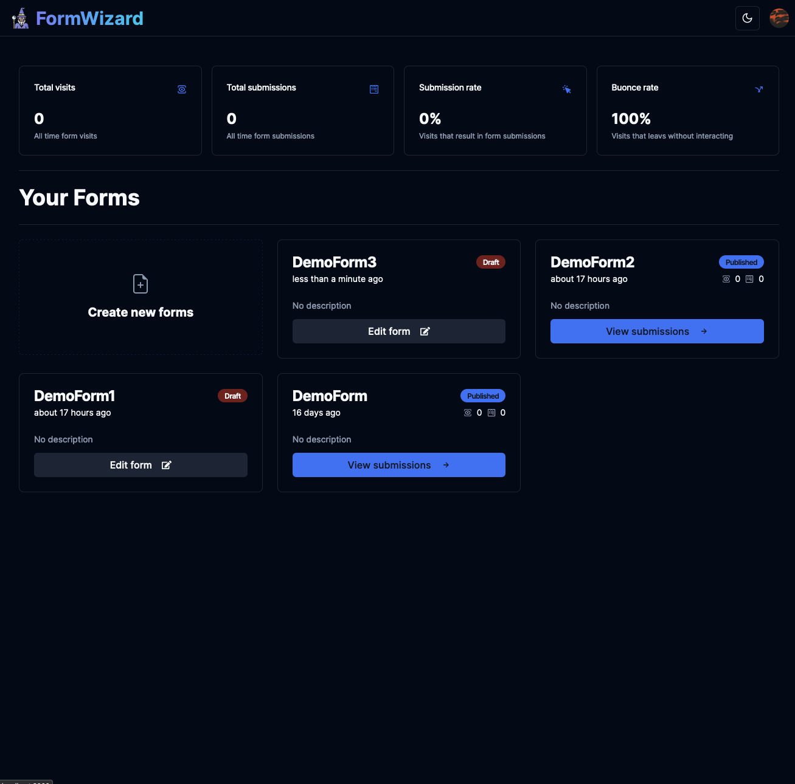
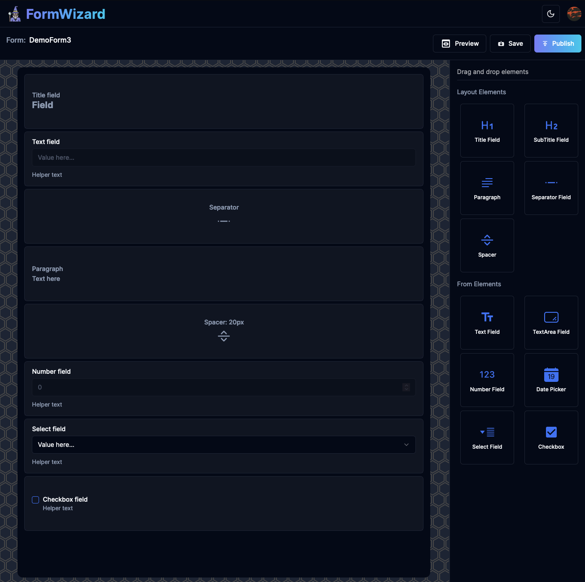
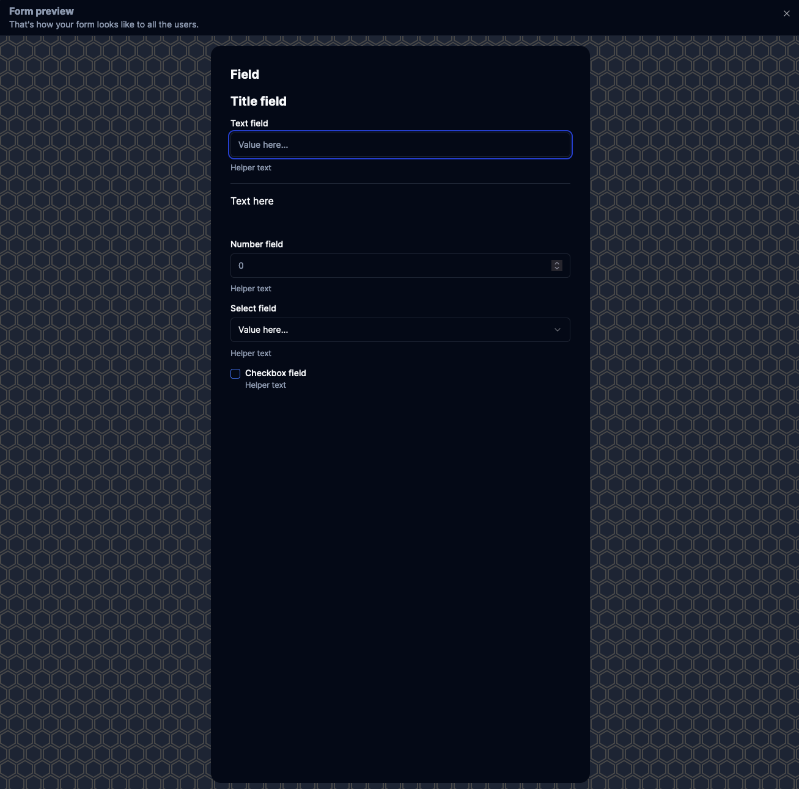
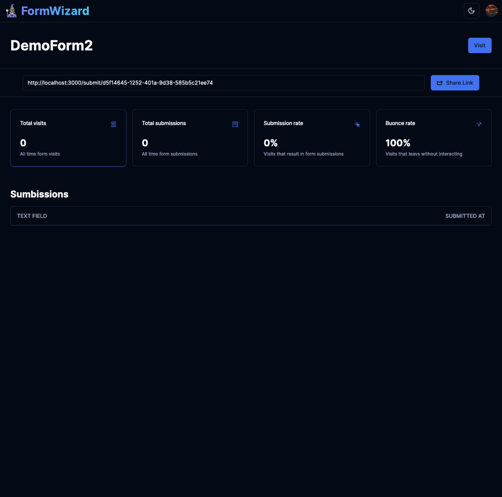

# 🔺What is it?🔺

Form Wizard is a web app that allows users to create interactive, customizable, and shareable forms.

## 🔺Why?🔺

Inspired by [this tutorial](https://www.youtube.com/watch?v=QGXUUXy0AMw&t=9748s), I really thought that the current building form possibilities were outdated and less capable of being simple and interactive. So, I built my own form builder.

## 🔺How?🔺

The app is built with React, TypeScript, TailwindCSS, Prisma, and DnD-Kit. It is fully integrated with all browsers, the server, and an authentication system.

## 🔺Functioning🔺

Dashboard and landing


Editor


Editor Preview


Form Daashboard and stats



## 🔺Getting Started🔺

First, run the development server:

```bash
npm run dev
# or
yarn dev
# or
pnpm dev
# or
bun dev
```

Open [http://localhost:3000](http://localhost:3000) with you broswer to take a look.
